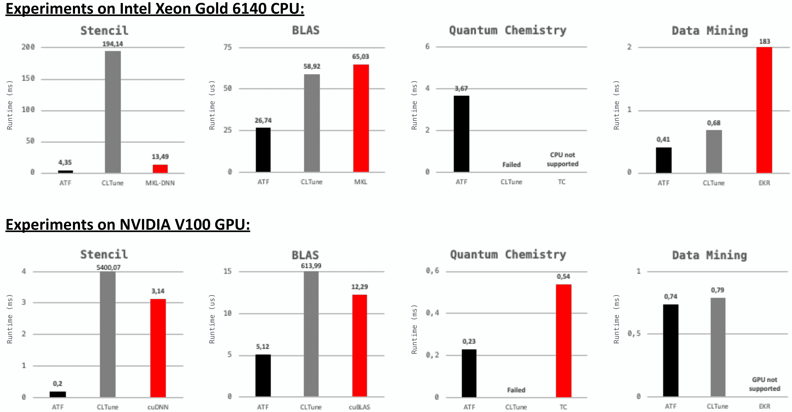

# Getting Started

## Building

### Dependencies
- C++ Compiler supporting at least C++14 (tested with GCC 9.3.0)
- _Optional:_ [OpenCL SDK](https://www.khronos.org/opencl) (only required when using ATF's pre-implemented cost function for auto-tuning OpenCL programs)
- _Optional:_ [CUDA Toolkit](https://developer.nvidia.com/cuda-toolkit) (only required when using ATF's pre-implemented cost function for auto-tuning CUDA programs)

### Build steps

ATF is used as an easy-to-use C++ header-only library: the user clones this repository and includes the ATF's `atf.hpp` header file in its C++ program.

ATF can be *optionally* configured by defining one or more of the following macros before including the `atf.hpp` header file:
- `#define PARALLEL_SEARCH_SPACE_GENERATION`: parallelizes search space generation (only required when search space generation takes too much time); may require using the C++ compiler with a flag for parallelization (e.g., `-pthread`)
- `#define ENABLE_CUDA_COST_FUNCTION`: enables using ATF's pre-implemented CUDA cost function
- `#define ENABLE_OPENCL_COST_FUNCTION`: enables using ATF's pre-implemented OpenCL cost function

## Example Usage

We illustrate the basic usage of ATF by auto-tuning the `saxpy` OpenCL kernel of the [CLBlast](https://github.com/CNugteren/CLBlast) library, based on ATF's GPL-based C++ user interface.

The kernel is implemented in CLBlast as follows:

```c
__kernel void saxpy( const int N, const float a, const __global float* x, __global float* y )
{
    for( int w = 0 ; w < WPT ; ++w ) 
    {
        const int index = w * get_global_size(0) + get_global_id(0);
        y[ index ] += a * x[ index ];
    }
}
```

It takes as inputs: the input size `N`, a floating point number `a`, and two `N`-sized vectors `x` and `y` of floating point numbers. 
The kernel computes for all {math}`i\in[1,\texttt{N}]_\mathbb{N}`:

    y[ i ] = a * x[ i ] + y[ i ] 
For simplicity, we removed in the kernel switching between single and double precision floating point numbers, as well as using OpenCL's vector data types.

To auto-tune a program with ATF, the programmer has to perform three steps, as briefly outlined in the following.
The complete ATF code for `saxpy` is available [here](https://gitlab.com/mdh-project/atf/-/tree/master/examples/full_examples/opencl__saxpy/opencl__saxpy.cpp).


### Step 1: Generate the Search Space

ATF automatically generates the search space for the user. 
For this, the user describes the space using tuning parameters, which are in this example:

1. `WPT` (*Work Per Thread*) -- a `size_t` parameter in the interval {math}`[1,\texttt{N}]_\mathbb{N}` that has to divide the input size `N`:

```c++
auto WPT = atf::tuning_parameter( "WPT", atf::interval<size_t>( 1,N ), atf::divides(N) );
```


2. `LS` (*Local Size*) -- a `size_t` parameter in the interval {math}`[1,\texttt{N}]_\mathbb{N}` that has to divide the global size `N/WPT`:

```c++
auto LS = atf::tuning_parameter( "LS", atf::interval<size_t>( 1,N ), atf::divides(N/WPT) );
```

The ATF user can set arbitrary constraints on tuning parameters.
For this, ATF allows using any arbitrary, user-defined C++ callable (e.g., a C++ lambda expression) as constraint function that takes as input a value within tuning parameter's range and returns either `true` (iff the constraint is satisfied) or `false` (iff the constraint is not satisfied). 

In this example, both tuning parameters use as constraints the ATF's pre-implemented `divides` constraint function. 

ATF currently provides the following, pre-implemented contraint functions:
  1. `divides`
  2. `is_multiple_of`
  3. `less_than` 
  4. `greater_than`
  5. `equal`
  6. `unequal`

To express complex constraints conveniently, contraint functions in ATF (including the ATF's pre-implemented constraints) can be arbitrarily combined via logical operators `&&` and `||`.

Interdependencis among tuning parameters are expressed in ATF via constraints.
For this, the constraint function is defined based on tuning parameters (which are used in the constraint's function definition as variables of their corresponding range type, e.g., type `int` when tuning parameter's range consists of integers).
For example, the constraint function of parameter `LS` uses `WPT` in its definition to express that parameter `LS` has to divide the global size `N/WPT`.

ATF's parameter constraints are described in detail [here](https://ieeexplore.ieee.org/abstract/document/8291912).


### Step 2: Implement a Cost Function

For high flexibility, the ATF user can use any arbitrary, self-implemented cost function. 
ATF allows as cost function any arbitrary C++ callable that takes as input a configuration of tuning parameters and returns a value for which operator `<` is defined, e.g., `size_t`. 
ATF interprets the cost function’s return value (e.g., program’s runtime) as the cost that has to be minimized during the auto-tuning process.

For user’s convenience, ATF provides pre-implemented cost functions for auto-tuning OpenCL and CUDA kernels in terms of runtime performance, as minimizing the runtime of OpenCL and CUDA applications is gaining more and more attention in the auto-tuning community. 

For our `saxpy` example, we use ATF's pre-implemented OpenCL cost function `atf::opencl`, as follows:

```c++
auto saxpy_kernel = atf::opencl::kernel< atf::scalar<int>   ,  // N
                                         atf::scalar<float> ,  // a
                                         atf::buffer<float> ,  // x
                                         atf::buffer<float> >  // y
                                       ( saxpy_kernel_as_string, "saxpy" );  // kernel's code & name

auto cf_saxpy = atf::opencl::cost_function( saxpy_kernel ).platform_id( 0 )                   // OpenCL platform id
                                                          .device_id( 0 )                     // OpenCL device id
                                                          .inputs( atf::scalar<int>( N )   ,  // N         
                                                                   atf::scalar<float>()    ,  // a    
                                                                   atf::buffer<float>( N ) ,  // x 
                                                                   atf::buffer<float>( N ) )  // y 
                                                          .global_size( N/WPT )               // OpenCL global size                                                          
                                                          .local_size( LS );                  // OpenCL local size
```

We first define the kernel straightforwardly as an ATF OpenCL kernel object `atf::opencl::kernel`.
Afterwards, we construct an ATF OpenCL cost function object of type `atf::opencl::cost_function`, which we customize with:
1) target device's OpenCL platform and device id; alternatively, the ATF user can chose a device by its platform and device name, e.g., `platform_name("NVIDIA")` and `device_name("V100")`, or based on its properties (e.g., the system's first found GPU, etc);
2) the kernel's inputs, which are in this example: the input size `N`, a random floating point number for `a` that is automatically generated by ATF (random data is the default input in auto-tuning), and two `N`-sized buffers for `x` and `y` that are also filled with random floating point numbers; ATF uses per default random data in the range {math}`(0,1]_\mathbb{R}` for floating point numbers and in range {math}`[1,10]_\mathbb{N}` for integers; user-defined ranges {math}`(\texttt{min},\texttt{max}]_\mathbb{R}` (floating point range) or {math}`[\texttt{min},\texttt{max}]_\mathbb{N}` (integer range) can be set via an optional argument: `atf::scalar<T>( {min,max} )` or `atf::buffer<T>( N, {min,max} )`, respectively;
3) the OpenCL global and local size, which we chose as: `N/WPT` (global size) and `LS` (local size) -- ATF allows defining both sizes as arbitrary, arithmetic C++ expressions which may contain tuning parameters for high experessivity.

Correctness can be optionally validated in ATF via function `check_result<i>( gold )` which checks the `i`-th buffer against std::vector `gold`.
Alternatively, the user can use instead of parameter `gold` a C++ callable (e.g., a lambda expression) that implements the computation of *gold* (e.g., when random data is used), as demonstrated [here](https://gitlab.com/mdh-project/atf/-/tree/master/examples/feature_demonstration/result_check/result_check.cpp).


### Step 3: Explore the Search Space

The ATF user explores the search space by creating an ATF tuner object and customizing it with the *tuning parameters* and a *search technique*:

```c++  
// explore the search space
auto tuning_result = atf::tuner().tuning_parameters( WPT, LS )
                                 .search_technique( atf::auc_bandit() )
                                 .tune( cf_saxpy , atf::evaluations(50) );
```
The tuning is started via function `tune` which takes as input the *cost function* (from Step 2) and *abort condition* (in this example, testing 50 configurations).
ATF then automatically explores the search space and returns object `tuning_result` which contains: the best found configuration of tuning parameters, the cost of that configuratioan, etc.

To reduce tuning time, ATF allows exploiting actual program computations also for the exploration phase, by allowing the user program to explicitly guide the exploration.
This is in particular benefical for iterative applications, where the code part to tune is called repeatedly in the program flow, allowing benefitting from the calls also for exploration.
For this, ATF provides functions `get_configuration` and `report_cost` which are used as an alternative to function `tune`, as demonstrated [here](https://gitlab.com/mdh-project/atf/-/tree/master/examples/feature_demonstration/program_guided_optimization/program_guided_optimization.cpp).


### Search Techniques

ATF currently provides the following, pre-implemented search techniques:
  
*Basic Search Techniques:*

  1. `exhaustive` 
  2. `random_search` 
  3. `simulated_annealing` 
  4. `differential_evolution` 
  5. `particle_swarm` 
  6. `pattern_search` 
  7. `torczon` 

*Meta Search Techniques:*

  1. `round_robin`
  2. `auc_bandit` (recommended)

Further techniques can be easily added to ATF by implementing a [straightforward interface](https://gitlab.com/mdh-project/atf/-/tree/master/include/search_technique.hpp).


### Abort Conditions

ATF currently provides the following, pre-implemented abort conditions:

1. `duration<D>(t)`: stops exploration after a user-defined time interval `t`; here, `D` is an `std::chrono::duration` and sets the time unit: `seconds`, `minutes`, etc.;

2. `evaluations(n)`: stops after `n` tested configurations;

3. `fraction(f)`: stops after `f*S` tested configurations, where `f` is a floating point number in `[0,1]` and `S` the search space size;	

4. `cost(c)`: stops when a configuration with a cost `<=c` has been found;
	
5. `speedup<D>(s,t)`: stops when within the last time interval `t` the cost could not be lowered by a factor `>=s`;
		
6. `speedup(s,n)`: stops when within the last `n` tested configurations the cost could not be lowered by a factor `>=s`.

If no abort condition is set, ATF uses `evaluations(S)`, where `S` is the search space size.

To meet complex user requirements, abort conditions can be combined by using the logical operators `&&` and `||`.

New abort conditions can be easily added to ATF by implementing the [corresponding interface](https://gitlab.com/mdh-project/atf/-/tree/master/include/abort_condition.hpp).


## Experimental Results

We present experimental results (discussed in detail [here](https://dl.acm.org/doi/abs/10.1145/3427093)) for auto-tunable [computations](https://ieeexplore.ieee.org/abstract/document/8891668?casa_token=mFNVnD2FYXMAAAAA:1DvXQy-Rl1Tm2eiYjaImBEylR0u-eHm-TbtyRs_yIgTdPKVpe5NhsPS-H414i0_ToRfVZyBdexsB) from popular domains:
*Stencil*, 
*BLAS* (Basic Linear Algebra Subroutines), 
*Quantum Chemistry*, and 
*Data Mining*.
In particular, we show that ATF is able to auto-tune the computations to higher performance than [CLTune](https://github.com/CNugteren/CLTune) which is an auto-tuning approach that also supports interdependencies among tuning parameters:

<br>



<br>

The figure shows runtimes (lower is better) of [implementations](https://ieeexplore.ieee.org/abstract/document/8891668?casa_token=mFNVnD2FYXMAAAAA:1DvXQy-Rl1Tm2eiYjaImBEylR0u-eHm-TbtyRs_yIgTdPKVpe5NhsPS-H414i0_ToRfVZyBdexsB) on CPU (top part of the figure) and GPU (bottom part) when auto-tuned with ATF (black bars) as compared to auto-tuning the implementations using CLTune (gray bars). 
We also compare to well-performing high-performance libraries which are often optimized by hand (red bars): [MKL-DNN v0.21.5](https://oneapi-src.github.io/oneDNN/v0/index.html), [MKL v2020](https://www.intel.com/content/www/us/en/develop/documentation/get-started-with-mkl-for-dpcpp/top.html), [cuDNN v7.6.5](https://developer.nvidia.com/cudnn), [cuBLAS v10.2.](https://developer.nvidia.com/cublas), [Tensor Comprehensions (TC)](https://github.com/facebookresearch/TensorComprehensions), and [EKR](https://dl.acm.org/doi/abs/10.1145/3297280.3297330?casa_token=Dg8tuKQMslUAAAAA:_0zipZ0ancafufunFVr9ygnETPlYpg5vNgNfyAsGxGEYsIWzTbTBF5Nosq6PhYFzOthvFSPPZGaB).


## Citations

Please use the following citation, when referring to ATF's:

1. **Internal Design & Implementation**

```latex
@article{10.1145/3427093, 
  author = {Rasch, Ari and Schulze, Richard and Steuwer, Michel and Gorlatch, Sergei},
  title = {Efficient Auto-Tuning of Parallel Programs with Interdependent Tuning Parameters via Auto-Tuning Framework (ATF)},
  year = {2021},
  issue_date = {March 2021},
  publisher = {Association for Computing Machinery},
  address = {New York, NY, USA},
  volume = {18},
  number = {1},
  issn = {1544-3566},
  url = {https://doi.org/10.1145/3427093},
  doi = {10.1145/3427093},
  journal = {ACM Trans. Archit. Code Optim.},
  month = {jan},
  articleno = {1},
  numpages = {26},
  keywords = {parallel programs, Auto-tuning, interdependent tuning parameters}
}
```

<br>

2) **DSL-Based Interface**

```latex
@article{https://doi.org/10.1002/cpe.4423,
  author = {Rasch, Ari and Gorlatch, Sergei},
  title = {ATF: A generic directive-based auto-tuning framework},
  journal = {Concurrency and Computation: Practice and Experience},
  volume = {31},
  number = {5},
  pages = {e4423},
  keywords = {auto-tuning, CLBlast, CLTune, CUDA, dependent tuning parameters, GEMM, many-core, multi-core, multi-objective auto-tuning, OpenCL, OpenTuner, tuning parameter constraints},
  doi = {https://doi.org/10.1002/cpe.4423},
  url = {https://onlinelibrary.wiley.com/doi/abs/10.1002/cpe.4423},
  eprint = {https://onlinelibrary.wiley.com/doi/pdf/10.1002/cpe.4423},
  note = {e4423 cpe.4423},
  year = {2019}
}
```    

<br>

3. **GPL-Based C++ Interface**

```latex
@INPROCEEDINGS{8291912,
  author={Rasch, Ari and Haidl, Michael and Gorlatch, Sergei},
  booktitle={2017 IEEE 19th International Conference on High Performance Computing and Communications; IEEE 15th International Conference on Smart City; IEEE 3rd International Conference on Data Science and Systems (HPCC/SmartCity/DSS)}, 
  title={ATF: A Generic Auto-Tuning Framework}, 
  year={2017},
  volume={},
  number={},
  pages={64-71},
  doi={10.1109/HPCC-SmartCity-DSS.2017.9}
}
```
